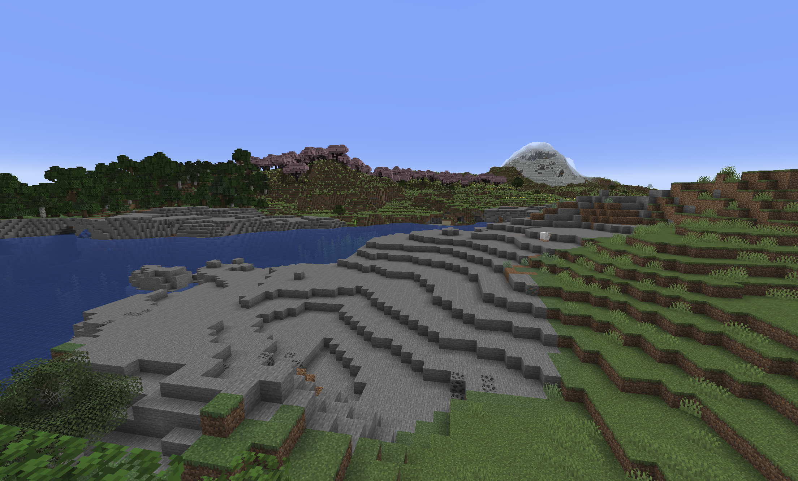

[![LinkedIn][linkedin-shield]][linkedin-url]

<!-- ABOUT THE PROJECT -->
## Minecraft Clone
 

This is a minecraft clone project developed in C++ using OpenGL designed to run on 64bit Windows. 

<!-- Screenshot --> 

  

### Features

* Simple but nice looking terrain generation using perlin / simplex noise.
* More than 10 types of blocks and more can be added easily.
* Supports plants (grass, flowers, trees, etc.) and transparency (glass).
* Day / night cycles and a textured sky dome.
* World changes persisted in a sqlite3 database.

### Play

Cloneing the repository and running the Minecraft.exe file inside dist folder 

### Controls

- WASD to move forward, left, backward, right.
- Space to jump.
- Left Click to destroy a block.
- Right Click or Cmd + Left Click to create a block.

### Implementation Details

#### Terrain Generation

The terrain is generated using Simplex noise - a deterministic noise function seeded based on position. So the world will always be generated the same way in a given location.

The world is split up into 32x32 block chunks in the XZ plane (Y is up). This allows the world to be “infinite” (floating point precision is currently a problem at large X or Z values) and also makes it easier to manage the data. Only visible chunks need to be queried from the database.

#### Rendering

Only exposed faces are rendered. This is an important optimization as the vast majority of blocks are either completely hidden or are only exposing one or two faces. Each chunk records a one-block width overlap for each neighboring chunk so it knows which blocks along its perimeter are exposed.

Only visible chunks are rendered. A naive frustum-culling approach is used to test if a chunk is in the camera’s view. If it is not, it is not rendered. This results in a pretty decent performance improvement as well.

Chunk buffers are completely regenerated when a block is changed in that chunk, instead of trying to update the VBO.

Text is rendered using a bitmap atlas. Each character is rendered onto two triangles forming a 2D rectangle.

“Modern” OpenGL is used - no deprecated, fixed-function pipeline functions are used. Vertex buffer objects are used for position, normal and texture coordinates. Vertex and fragment shaders are used for rendering. Matrix manipulation functions are in matrix.c for translation, rotation, perspective, orthographic, etc. matrices. The 3D models are made up of very simple primitives - mostly cubes and rectangles. These models are generated in code in cube.c.

Transparency in glass blocks and plants (plants don’t take up the full rectangular shape of their triangle primitives) is implemented by discarding magenta-colored pixels in the fragment shader.

#### Dependencies

* GLEW is used for managing OpenGL extensions across platforms.
* GLFW is used for cross-platform window management.
* CURL is used for HTTPS / SSL POST for the authentication process.

[linkedin-url]: https://www.linkedin.com/in/kai-yu-084a92196/
